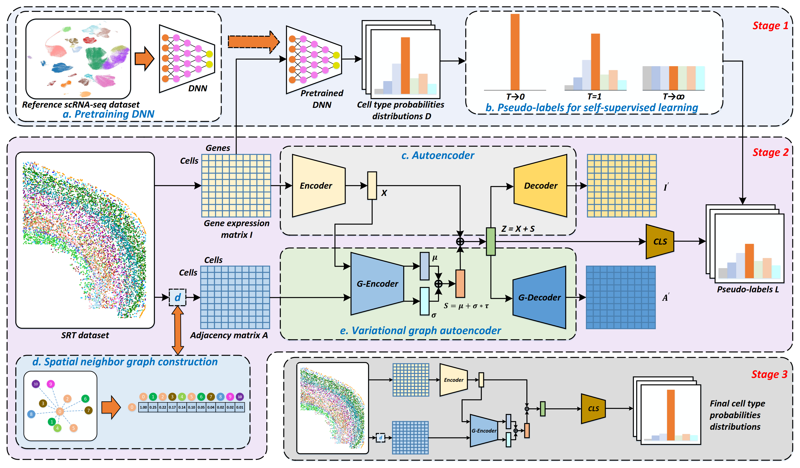
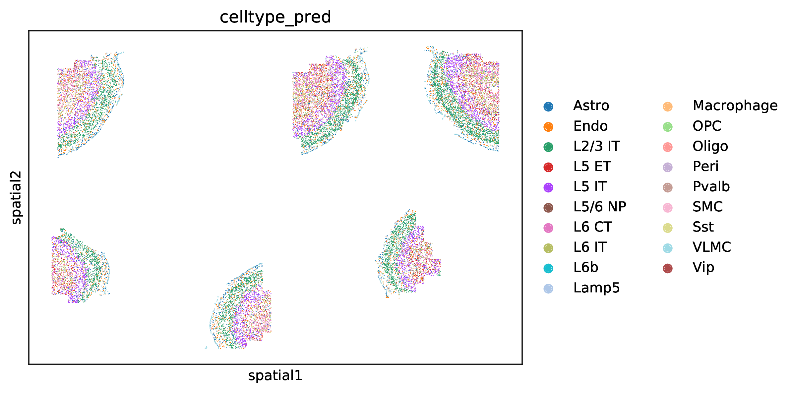

# spatial-ID

 

### Spatial-ID: a cell typing method for spatially resolved transcriptomics via transfer learning and spatial embedding
Spatially resolved transcriptomics (SRT) provides the opportunity to investigate the gene expression profiles and the spatial context of cells in naive state. Cell type annotation is a crucial task in the spatial transcriptome analysis of cell and tissue biology. In this study, we propose Spatial-ID, a supervision-based cell typing method, for high-throughput cell-level SRT datasets that integrates transfer learning and spatial embedding. Spatial-ID effectively incorporates the existing knowledge of reference scRNA-seq datasets and the spatial information of SRT datasets. 

# Dependences

# Datasets

- MERFISH: 280,186 cells * 254 genes, 12 samples. [https://doi.brainimagelibrary.org/doi/10.35077/g.21](https://doi.brainimagelibrary.org/doi/10.35077/g.21)
- MERFISH-3D: 213,192 cells * 155 genes, 3 samples. [https://datadryad.org/stash/dataset/doi:10.5061/dryad.8t8s248](https://datadryad.org/stash/dataset/doi:10.5061/dryad.8t8s248)
- Slide-seq: 207,335 cells * 27181 genes, 6 samples. [https://www.dropbox.com/s/ygzpj0d0oh67br0/Testis_Slideseq_Data.zip?dl=0](https://www.dropbox.com/s/ygzpj0d0oh67br0/Testis_Slideseq_Data.zip?dl=0)
- NanoString: 83,621 cells * 980 genes, 20 samples. [https://nanostring.com/resources/smi-ffpe-dataset-lung9-rep1-data/](https://nanostring.com/resources/smi-ffpe-dataset-lung9-rep1-data/)

# Usage

- Run cell\_type\_annotation\_for\_merfish.py to annotate cells in MERFISH dataset.
- Run cell\_type\_annotation\_for\_hyp3d.py to annotate cells in MERFISH-3D dataset.
- Run cell\_type\_annotation\_for\_slideseq.py to annotate cells in Slide-seq dataset.
- Run cell\_type\_annotation\_for\_nanostring.py to annotate cells in NanoString dataset.

p.s. You may need to unzip dnn\_model/checkpoint\_Slide-seq\_DM1.t7 first before running cell\_type\_annotation\_for\_slideseq.py.

[!!!] Note: An AttributeError saying that 'GELU' object has no attribute 'approximate' may occurs if your pytorch version is higher than 1.10.0.  You can simply downgrade pytorch to 1.8.1 or modify the source code of pytorch temporarily.

# Example

1. Put downloaded MERFISH data (e.g. mouse1_sample1.h5ad) in "dataset/MERFISH/" (as in Line 30 of cell\_type\_annotation\_for\_merfish.py).
2. Run cell\_type\_annotation\_for\_merfish.py to annotate cells of mouse1_sample1 data.
3. 4 files can be found in "result/MERFISH/" (as in Line 31 of cell\_type\_annotation\_for\_merfish.py):
	- spatialID-mouse1\_sample1.t7: Checkpoint of the self-supervised model in Stage 2.
	- spatialID-mouse1\_sample1.h5ad: Updated H5AD file with annotation result stored.
	- spatialID-mouse1\_sample1.csv: Annotation results with column "cell" representing cell IDs and "celltype_pred" representing annotated cell types.
	- spatialID-mouse1\_sample1.pdf: Visualization of annotation results as shown below.

# Disclaimer

This tool is for research purpose and not approved for clinical use.

This is not an official Tencent product.

# Coypright

This tool is developed in Tencent AI Lab.

The copyright holder for this project is Tencent AI Lab.

All rights reserved.
